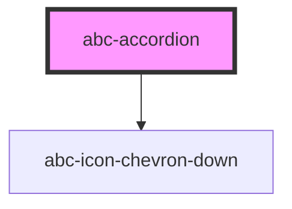

# abc-accordion

<!-- Auto Generated Below -->

## Properties

| Property  | Attribute | Description | Type                                                  | Default                    |
| --------- | --------- | ----------- | ----------------------------------------------------- | -------------------------- |
| `item`    | `item`    |             | `string \| undefined`                                 | `undefined`                |
| `open`    | `open`    |             | `boolean`                                             | `false`                    |
| `summary` | `summary` |             | `string`                                              | `undefined`                |
| `variant` | `variant` |             | `ACCORDION_VARIANTS.GREY \| ACCORDION_VARIANTS.WHITE` | `ACCORDION_VARIANTS.WHITE` |

## Events

| Event            | Description | Type                                                          |
| ---------------- | ----------- | ------------------------------------------------------------- |
| `accordionClick` |             | `CustomEvent<{ open: boolean; item?: string \| undefined; }>` |

## Dependencies

### Depends on

- [abc-icon-chevron-down](../icons)

### Graph

----------------------------------------------

*Built with [StencilJS](https://stenciljs.com/)*
