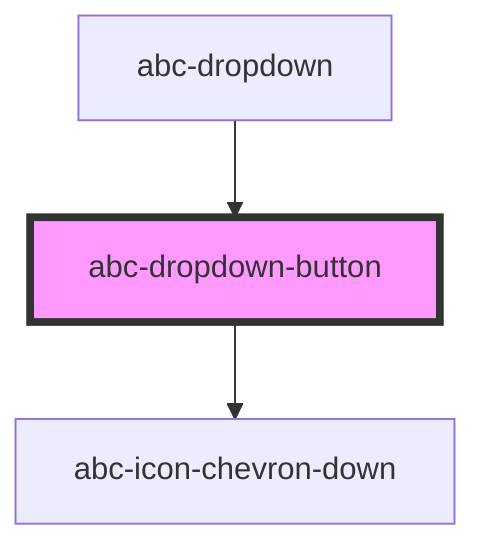

# abc-dropdown-button

<!-- Auto Generated Below -->

## Properties

| Property            | Attribute     | Description | Type      | Default     |
| ------------------- | ------------- | ----------- | --------- | ----------- |
| `disabled`          | `disabled`    |             | `boolean` | `false`     |
| `label`             | `label`       |             | `string`  | `undefined` |
| `open`              | `open`        |             | `boolean` | `false`     |
| `placeholder`       | `placeholder` |             | `boolean` | `false`     |
| `required`          | `required`    |             | `boolean` | `false`     |
| `text` _(required)_ | `text`        |             | `string`  | `undefined` |

## Events

| Event                 | Description | Type                |
| --------------------- | ----------- | ------------------- |
| `dropdownButtonBlur`  |             | `CustomEvent<void>` |
| `dropdownButtonClick` |             | `CustomEvent<void>` |
| `dropdownButtonFocus` |             | `CustomEvent<void>` |

## Dependencies

### Used by

 - [abc-dropdown](.)

### Depends on

- [abc-icon-chevron-down](../icons)

### Graph

----------------------------------------------

*Built with [StencilJS](https://stenciljs.com/)*
